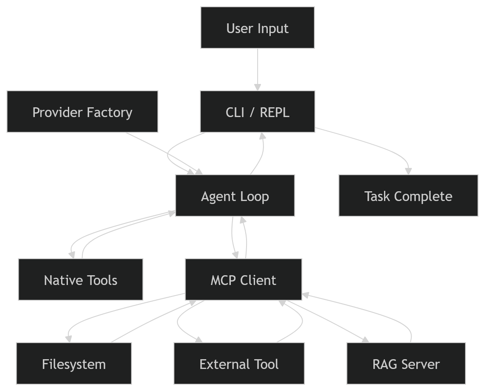
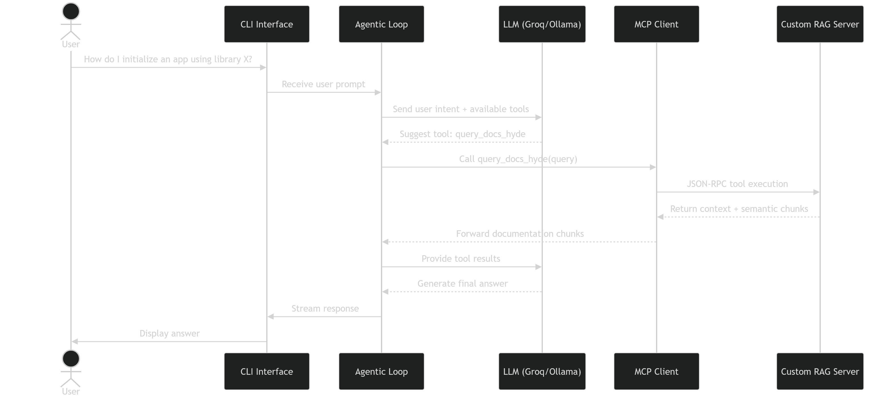
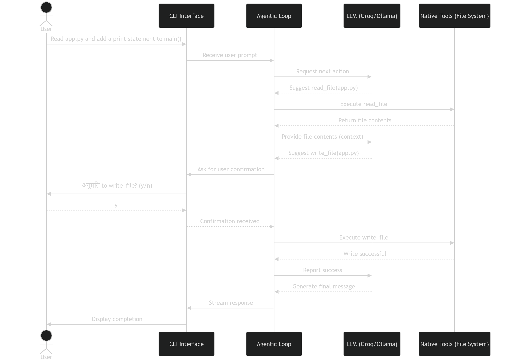
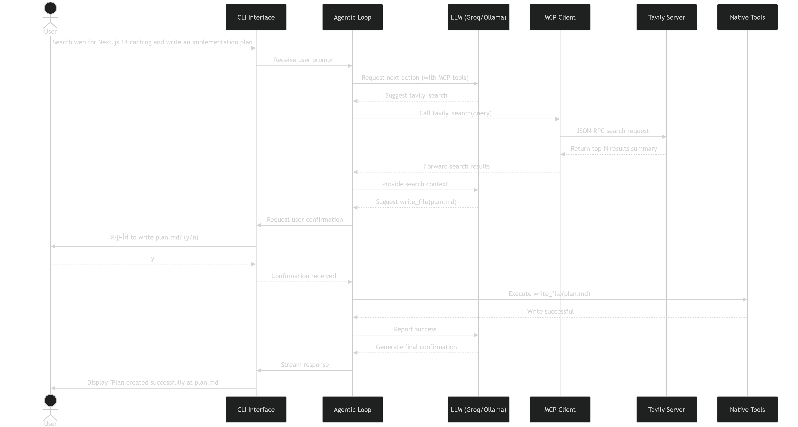

# AutoDev: Autonomous AI Coding Assistant

AutoDev is a powerful command-line AI coding assistant that takes natural language instructions, reasons about a local codebase, and autonomously reads, edits, and executes code to complete tasks. Unlike chat-based assistants, AutoDev operates as an autonomous agent that takes actions to accomplish the user's task.

## Installation

### 1. Python Environment & Requirements
Ensure you have Python installed. Set up a virtual environment and install dependencies:
```bash
python -m venv .venv
# On Windows:
.venv\Scripts\activate
# On Mac/Linux:
# source .venv/bin/activate
pip install -r requirements.txt
```

### 2. Local Models (Ollama)
To use local models, you will first need to install Ollama.
1. Download Ollama for Windows from: [https://ollama.com/download/OllamaSetup.exe](https://ollama.com/download/OllamaSetup.exe)
2. Install the application.
3. Open a terminal and pull the local model:
   ```bash
   ollama pull llama3.2
   ```
4. Verify the installation by running the model test:
   ```bash
   ollama run llama3.2
   ```

## Configuration

Before running AutoDev, configure your environment variables and MCP servers:

1. **Environment Variables**: Copy `.env.example` to `.env`. Edit `.env` to add any required API keys (e.g., `GROQ_API_KEY`, `TAVILY_API_KEY`) and customize settings like `AUTODEV_PROVIDER`.

2. **MCP Servers**: Copy `mcp_servers.json.example` to `mcp_servers.json`. To change the directory that the official filesystem MCP server has access to, edit `mcp_servers.json` and change the absolute path in the `"args"` array for the `filesystem` server.

## Usage

AutoDev can be executed directly from your terminal. By default, it will use the model provider configured in your `.env` file. You can override the provider directly via CLI arguments:

- **Run with default settings**:
  ```bash
  autodev
  ```
  *(Alternative: `python -m autodev.main`)*

- **Run explicitly with Groq**:
  ```bash
  autodev --groq
  ```

- **Run explicitly with Ollama**:
  ```bash
  autodev --ollama
  ```

## Feature Specifications

### 1. Agentic Loop
The core of AutoDev is the agentic loop, implemented in `autodev/agent.py`.
- **Natural Language Instructions:** Users provide natural language inputs via the REPL.
- **Autonomous Reasoning:** The system binds available tools to the LLM using LangChain. The loop runs up to a configurable maximum number of steps, deciding which tool to call next, assessing the outputs (errors, tool reflections, filesystem state), and determining when the task is complete.
- **Model-agnostic** — works with Ollama (local) and Groq
- **MCP-native** — uses the Model Context Protocol for all tool integrations.
- **RAG-powered docs** — a custom local vector store enables retrieval-augmented context from library documentation.
- **Safety controls** — configurable confirmation mode: auto-execute or require human approval before each tool call.
- **Streaming CLI** — rich terminal output with status indicators, tool call visibility, and token streaming.

### 2. Tool Calling
AutoDev has native capabilities to act on the file system and execute system commands (`autodev/tools.py`), which are enriched by MCP dynamically:
- **File & Shell Operations:** Reading/writing files, regex searching across the codebase (`search_code`), and running shell commands (`run_shell`).
- **User Confirmation & Auto-Execution:** Supports configurable execution modes. The system prompts for user confirmation before executing mutating operations (writes/shells) by default. Users can opt into `auto` mode for autonomous execution without prompts.
- **Status Indication:** The CLI indicates when tools are executed, showing reasoning and results using a `rich` console interface.

### 3. Provider Abstraction
The agent is inherently model-agnostic, implemented in `autodev/providers/factory.py` using LangChain's standardized chat model abstractions.
- **Local Models:** Supports local inference seamlessly via Ollama.
- **Cloud Providers:** Integrates seamlessly with cloud providers such as Groq via `ChatGroq`.
The choice of provider can be managed dynamically through `.env` configurations or CLI arguments (e.g., `--groq` or `--ollama`), providing full flexibility based on the user's requirements.

### 4. CLI Interface
AutoDev features a rich Terminal REPL (Read-Eval-Print Loop) interface (`autodev/cli/repl.py`).
- Built with Python's `rich` library to deliver visually appealing, formatted outputs.
- Features real-time status indicators for MCP server connections and execution modes.
- Streaming responses with clear differentiation between task outputs, tool executions, and system messages.

### 5. Model Context Protocol (MCP) Integration
AutoDev features a fully dynamic MCP client (`autodev/mcp/client.py`) that handles connecting to configured servers over standard I/O (Stdio), retrieving `list_tools`, parsing JSON Schemas dynamically into Pydantic models, and exposing them directly to the LangChain LLM agent.

It integrates with the three required servers as highlighted in `mcp_servers.json.example`:
1. **Official Filesystem Server:** `@modelcontextprotocol/server-filesystem` via local `npx` execution. This allows the model to leverage safe filesystem commands directly alongside native tools.
2. **External Resource Server:** `tavily-mcp` for external real-time web search capabilities.
3. **Custom MCP Server with Advanced RAG:** Provided locally via `autodev/rag_server.py`.

#### Advanced RAG Characteristics (Custom MCP Server)
The custom built local MCP server offers a robust, local Advanced RAG implementation configured for documentation queries:
- **Semantic Chunking:** Leverages LangChain's `SemanticChunker` (`langchain_experimental`) and `SentenceTransformerEmbeddings` to contextually slice texts.
- **Vector Database:** Embeds and persistently stores vectors across agent sessions using Chroma (`langchain_chroma`). The database is populated once (`ingest_docs` tool) but queried directly in subsequent runs.
- **Advanced RAG Technique (HyDE):** Employs Hypothetical Document Embeddings (HyDE). When documentation is queried (`query_docs_hyde`), it utilizes a local `ChatOllama` instance to generate a synthetic, hypothetical answer to the user's question, embedding the synthetic passage to accurately retrieve semantically relevant document chunks.
- **Dynamic Usage:** The exact chunks retrieved are passed effortlessly back through the Stdio MCP Client to inform the primary LLM agent's prompts.


## Architecture & Technology Stack
- **Language:** Python 3.10+
- **LLM/Agent Framework:** LangChain & LangChain Experimental
- **CLI Framework:** Rich (for REPL, status tables, and syntax highlighting)
- **Local Inference:** Ollama 
- **Cloud Inference:** Groq API
- **Vector Database:** Chroma (`langchain_chroma`)
- **Embeddings/RAG:** `SentenceTransformerEmbeddings`, LangChain `SemanticChunker`
- **MCP Client:** Custom dynamic standard I/O (Stdio) integration for `mcp` servers
- **Dependency Management:** `pip` & `pyproject.toml`

## System Information Flow (State Diagram)

The following state diagram illustrates how information flows through the core components of the AutoDev system:



## Sequence Diagrams (Usage Scenarios)

The following sequence diagrams illustrate three distinct end-to-end operational flows showing how the overarching Autonomous Agent, CLI, LLM, MCP, and tools interact.

### Scenario 1: Querying Library Documentation via Custom MCP RAG


### Scenario 2: Reading and Editing a File (With User Confirmation)


### Scenario 3: Web Search leading to Implementation Plan Generation

